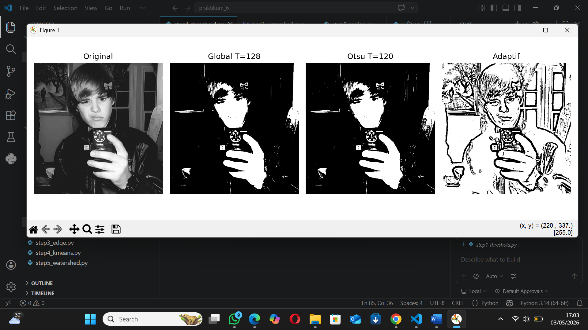
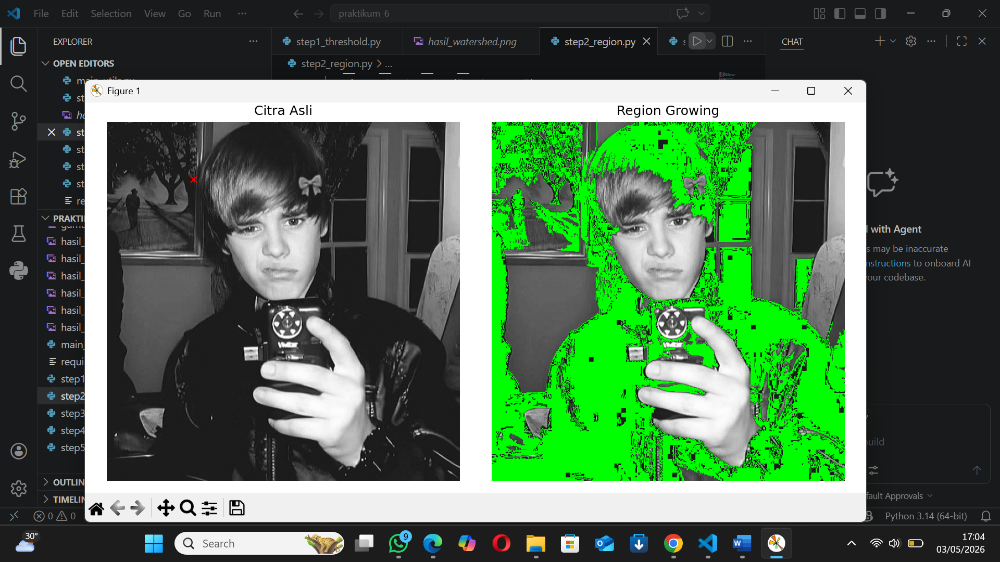
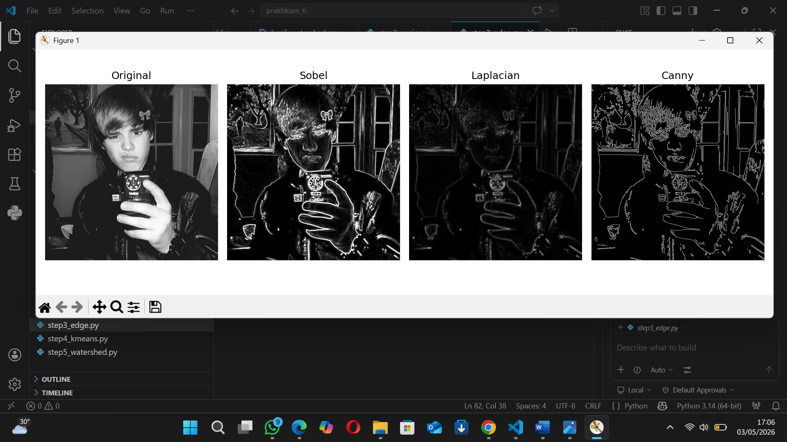
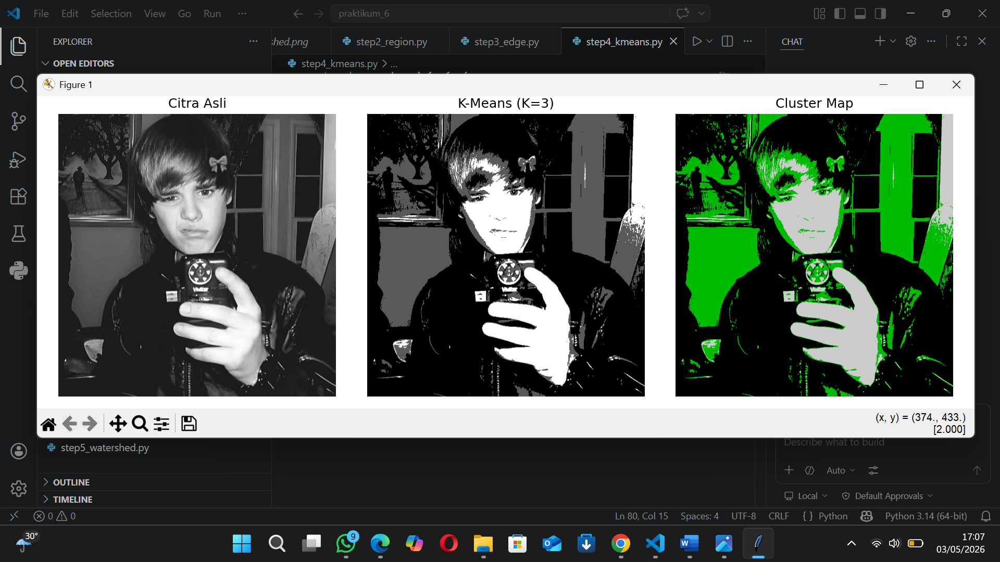
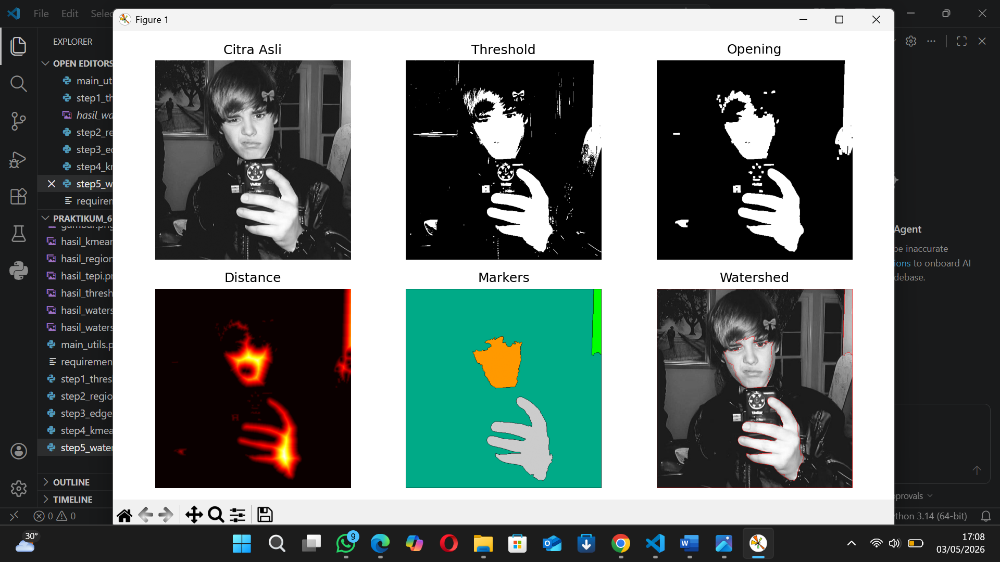
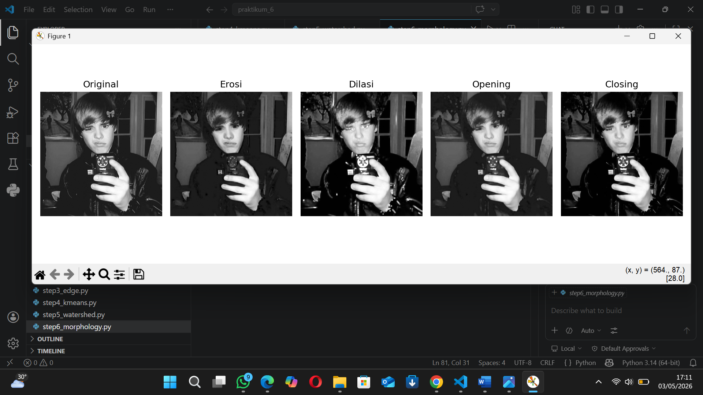

# UTS_pengolahan-citra-praktikum-6
Implementasi metode segmentasi citra menggunakan Python dan OpenCV: thresholding, region growing, edge detection, k-means, dan watershed.

##   Identitas

* **Nama**: Rafi Ubaydillah
* **NIM**: 312410542
* **Kelas**: I241E
* **Dosen Pengampu**: Dr. Muhamad Fatchan, S.Kom., M.Kom.

---

## 📌 Deskripsi

Project ini berisi implementasi beberapa metode segmentasi citra menggunakan Python dan OpenCV.

Metode yang digunakan:

* Thresholding
* Region Growing
* Edge Detection
* K-Means Clustering
* Watershed Segmentation

---

## ⚙️ Instalasi

Install library terlebih dahulu:

```bash
pip install -r requirements.txt
```

---

## 🖼️ Dataset (Gambar)

Gambar yang digunakan adalah gambar sendiri:


---

## 🔍 1. Thresholding

Metode:

* Global
* Otsu
* Adaptive

📸 **Hasil:**



---

## 🌱 2. Region Growing

Mengambil area berdasarkan kemiripan intensitas dari titik seed.

📸 **Hasil:**



---

## 🧭 3. Edge Detection

Metode:

* Sobel
* Laplacian
* Canny

📸 **Hasil:**



---

## 🎯 4. K-Means Clustering

Segmentasi berdasarkan jumlah cluster (K).

📸 **Hasil:**



---

## 🌊 5. Watershed

Segmentasi berbasis region dan marker.

📸 **Hasil:**



---

## 🧱 6. Morphological Operations

Operasi:
- Erosi
- Dilasi
- Opening
- Closing



---

## ▶️ Cara Menjalankan

Jalankan tiap file:

```bash
python step1_threshold.py
python step2_region_growing.py
python step3_edge.py
python step4_kmeans.py
python step5_watershed.py
```

---

## 📊 Kesimpulan

* Thresholding cocok untuk segmentasi sederhana
* Region Growing tergantung titik awal (seed)
* Edge Detection untuk mendeteksi batas objek
* K-Means untuk clustering piksel
* Watershed untuk segmentasi objek kompleks
